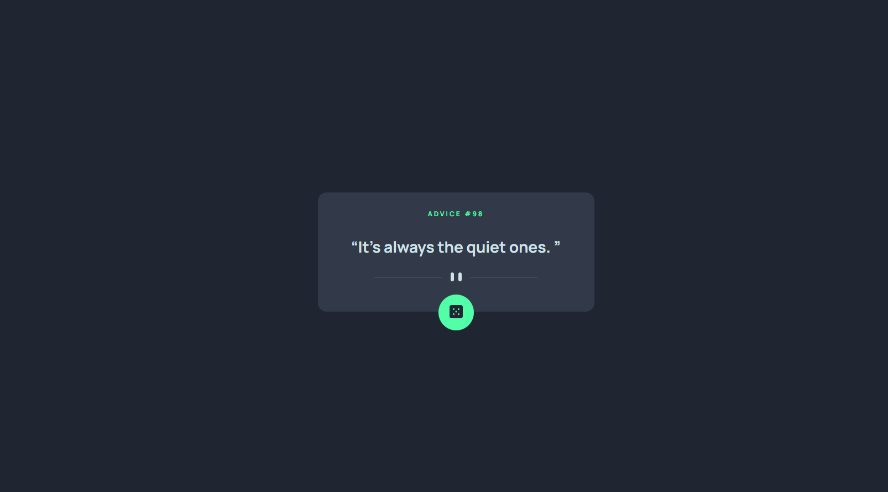

# Frontend Mentor - Advice generator app solution

This is a solution to the [Advice generator app challenge on Frontend Mentor](https://www.frontendmentor.io/challenges/advice-generator-app-QdUG-13db). Frontend Mentor challenges help you improve your coding skills by building realistic projects.

## Table of contents

- [Frontend Mentor - Advice generator app solution](#frontend-mentor---advice-generator-app-solution)
  - [Table of contents](#table-of-contents)
  - [Overview](#overview)
    - [The challenge](#the-challenge)
    - [Screenshot](#screenshot)
    - [Links](#links)
  - [My process](#my-process)
    - [Built with](#built-with)
    - [What I learned](#what-i-learned)
  - [Author](#author)

## Overview

### The challenge

Users should be able to:

- View the optimal layout for the app depending on their device's screen size
- See hover states for all interactive elements on the page
- Generate a new piece of advice by clicking the dice icon

### Screenshot



### Links

- Solution URL: [Solution for Advice Generator](https://www.frontendmentor.io/solutions/advice-generator-with-reactreduxtoolkit-5SXzCz_WYj)
- Live Site URL: [Advice Generator](https://advice-generator-psi-smoky.vercel.app/)

## My process

### Built with

- HTML
- CSS
- [React](https://reactjs.org/) - JS library
- [Create React App](https://nextjs.org/) - React framework
- [Redux Toolkit](https://redux-toolkit.js.org/introduction/getting-started)

### What I learned

Using Typescript in React with Redux

```Typescript
// app/store.ts
import { configureStore } from '@reduxjs/toolkit';
import adviceReducer from '../features/adviceSlice';

export const store = configureStore({
  reducer: {
    advice: adviceReducer,
  },
});

// Inferred the `RootState` and 'AppDispatch' types from the store itself
export type RootState = ReturnType<typeof store.getState>;
// Inferred type: {posts: PostState, comments: CommentState, users: UserState}
export type AppDispatch = typeof store.dispatch;
```

Using hooks for dispatch and selectors

```Typescript
// app/hook.ts
import { useDispatch, useSelector } from 'react-redux';
import type { TypedUseSelectorHook } from 'react-redux';
import { AppDispatch, RootState } from './store';
export const useAppDispatch: () => AppDispatch = useDispatch;
export const useAppSelector: TypedUseSelectorHook<RootState> = useSelector;

```

## Author

- Frontend Mentor - [@rohanmaharjan247](https://www.frontendmentor.io/profile/rohanmaharjan247)
